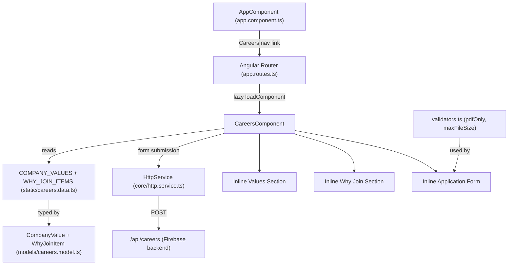

# Design Document: Careers Page

## Overview

The Careers page is a new lazy-loaded route (`/careers`) on the Compufy Technology marketing website. It presents the company's culture and values to prospective candidates, highlights reasons to join the team, and provides a typed reactive application form for submitting name, designation, years of experience, and a PDF resume.

The page follows the same structural pattern as the existing Who We Are and Services pages: a standalone Angular component with `ChangeDetectionStrategy.OnPush`, an inline template, Tailwind utility classes, and static content sourced from typed files under `src/app/data/`. The application form follows the Contact page pattern: typed `FormGroup<T>`, custom validators in a co-located `validators.ts`, and submission via `HttpService`.

---

## Architecture



The component is self-contained — all three sections (values, why join, application form) are rendered inline within `CareersComponent`. No child sub-components are needed given the page's scope, consistent with the Who We Are page pattern.

---

## Components and Interfaces

### CareersComponent

- Path: `src/app/features/careers/careers.component.ts`
- Selector: `app-careers`
- `standalone: true`, `ChangeDetectionStrategy.OnPush`
- Inline template, Tailwind-only styling
- Reads `COMPANY_VALUES` and `WHY_JOIN_ITEMS` directly (no service injection for static data)
- Injects `HttpService` for form submission
- Signals: `submitted = signal(false)`, `submitting = signal(false)`, `submitError = signal<string | null>(null)`
- Imports: `ReactiveFormsModule`

### Validators

- Path: `src/app/features/careers/validators.ts`
- `pdfOnly(): ValidatorFn` — returns `{ pdfOnly: true }` when `control.value` is a `File` with `type !== 'application/pdf'`
- `maxFileSize(bytes: number): ValidatorFn` — returns `{ maxFileSize: { max: bytes, actual: size } }` when `control.value` is a `File` with `size > bytes`

### Route Registration

`src/app/app.routes.ts` gains:
```typescript
{
  path: 'careers',
  loadComponent: () =>
    import('./features/careers/careers.component').then(m => m.CareersComponent),
}
```

### Navigation Update

`src/app/app.component.ts` gains a "Careers" `routerLink="/careers"` nav entry alongside the existing Home, Services, Who We Are, and Contact links.

### API Endpoint

`src/app/data/constants/api.constants.ts` gains:
```typescript
CAREERS_SUBMIT: '/api/careers'
```

---

## Data Models

### `src/app/data/models/careers.model.ts`

```typescript
export interface CompanyValue {
  title: string;         // e.g. "Innovation First"
  description: string;  // one-sentence description
  accentColor: 'brand-primary' | 'brand-secondary' | 'brand-accent';
}

export interface WhyJoinItem {
  icon: string;          // emoji or lucide icon name
  title: string;         // e.g. "Accelerated Growth"
  description: string;  // supporting description
}
```

### `src/app/data/static/careers.data.ts`

```typescript
import { CompanyValue, WhyJoinItem } from '../models/careers.model';

export const COMPANY_VALUES: CompanyValue[] = [
  // minimum 3 entries, each with title, description, accentColor
];

export const WHY_JOIN_ITEMS: WhyJoinItem[] = [
  // minimum 3 entries covering growth, environment, learning culture
];
```

### Application Form Controls

```typescript
interface CareersFormControls {
  fullName:          FormControl<string | null>;
  designation:       FormControl<string | null>;
  yearsOfExperience: FormControl<number | null>;
  resume:            FormControl<File | null>;
}
```

Validators per field:

| Field | Validators |
|---|---|
| `fullName` | `Validators.required`, `minLengthTrimmed(2)` |
| `designation` | `Validators.required` |
| `yearsOfExperience` | `Validators.required`, `Validators.min(0)`, `Validators.max(50)` |
| `resume` | `Validators.required`, `pdfOnly()`, `maxFileSize(2 * 1024 * 1024)` |

`minLengthTrimmed` is imported from `src/app/features/contact/validators.ts` (already exists).

### File Input Handling

The `resume` `FormControl<File | null>` is updated via a `(change)` event handler on the `<input type="file">` element:

```typescript
onFileChange(event: Event): void {
  const input = event.target as HTMLInputElement;
  const file = input.files?.[0] ?? null;
  this.applicationForm.controls.resume.setValue(file);
  this.applicationForm.controls.resume.markAsTouched();
}
```

The selected file name is displayed using a `computed()` signal derived from the control value.

---

## Correctness Properties

*A property is a characteristic or behavior that should hold true across all valid executions of a system — essentially, a formal statement about what the system should do. Properties serve as the bridge between human-readable specifications and machine-verifiable correctness guarantees.*

### Property 1: Valid form values produce a valid form

*For any* combination of a non-empty fullName with at least 2 trimmed characters, a non-empty designation, a yearsOfExperience in [0, 50], and a File with type `application/pdf` and size ≤ 2 097 152 bytes, the application form should be valid and the submit button should be enabled.

**Validates: Requirements 5.10**

### Property 2: Short full name is always invalid

*For any* string whose trimmed length is fewer than 2 characters (including empty strings and whitespace-only strings), the `fullName` control should be marked invalid.

**Validates: Requirements 5.1, 5.2**

### Property 3: Out-of-range years of experience is always invalid

*For any* number less than 0 or greater than 50, the `yearsOfExperience` control should be marked invalid.

**Validates: Requirements 5.5**

### Property 4: Non-PDF file always fails pdfOnly validator

*For any* `File` object whose `type` property is not `'application/pdf'`, the `pdfOnly()` validator should return a non-null error object containing the `pdfOnly` key.

**Validates: Requirements 5.7, 7.2**

### Property 5: Oversized file always fails maxFileSize validator

*For any* `File` object whose `size` property exceeds 2 097 152 bytes, the `maxFileSize(2 * 1024 * 1024)` validator should return a non-null error object containing the `maxFileSize` key.

**Validates: Requirements 5.8, 7.3**

### Property 6: Invalid form submission marks all controls touched

*For any* application form state where at least one control is invalid, calling `onSubmit()` should result in all four controls (`fullName`, `designation`, `yearsOfExperience`, `resume`) being marked as touched.

**Validates: Requirements 5.9**

### Property 7: All static content items render their title and description

*For any* array of `CompanyValue` or `WhyJoinItem` objects, every item's `title` and `description` should appear in the rendered DOM — none omitted regardless of content or array length.

**Validates: Requirements 2.1, 3.1, 3.3**

---

## Error Handling

### Form Validation Errors

Each control displays its error message only when the control is both `invalid` and `touched`, preventing premature error display before the user interacts:

| Control | Error key | Message |
|---|---|---|
| `fullName` | `required` | "Full name is required" |
| `fullName` | `minLengthTrimmed` | "Name must be at least 2 characters" |
| `designation` | `required` | "Designation is required" |
| `yearsOfExperience` | `required` | "Years of experience is required" |
| `yearsOfExperience` | `min` / `max` | "Please enter a valid number of years (0–50)" |
| `resume` | `required` | "Resume is required" |
| `resume` | `pdfOnly` | "Only PDF files are accepted" |
| `resume` | `maxFileSize` | "File size must not exceed 2 MB" |

`pdfOnly` is checked before `maxFileSize` in the validators array, so MIME type errors take priority (Requirement 7.5).

### Submission Errors

- `submitting` signal is set to `true` before the HTTP call and reset to `false` in both `next` and `error` callbacks (Requirement 6.4, 6.5).
- On success: `submitted` signal is set to `true`, replacing the form with a success message (Requirement 6.2).
- On error: `submitError` signal is set to a user-facing message; the form fields are preserved (Requirement 6.3).
- HTTP errors are also handled globally by `HttpErrorInterceptor` + `ErrorHandlerService`, consistent with the rest of the app.

### Route Safety

The new `/careers` route is registered before the `**` wildcard redirect, so it takes precedence correctly.

---

## Testing Strategy

### Unit Tests (`careers.component.spec.ts`)

Focus on specific examples, integration points, and edge cases:

- Component renders without errors
- Route `/careers` exists in `app.routes.ts` and uses `loadComponent`
- Nav link to `/careers` is present in `AppComponent`
- `COMPANY_VALUES` has at least 3 entries with non-empty title and description
- `WHY_JOIN_ITEMS` has at least 3 entries with non-empty title and description
- Form is invalid when any required field is empty
- `onSubmit()` with invalid form marks all controls touched and does not call `HttpService`
- `onSubmit()` with valid form calls `HttpService.post` with correct endpoint
- On success response, `submitted()` becomes `true`
- On error response, `submitError()` is set and form fields are preserved
- `submitting()` is `true` during in-flight request and `false` after response
- File input `accept` attribute is `".pdf"`
- Selected file name is displayed after a valid file is chosen
- `aria-describedby` links error messages to their inputs

### Property-Based Tests (`careers.component.pbt.spec.ts`)

Use **fast-check 4**. Minimum **100 iterations** per property.

Each test is tagged:
`// Feature: careers-page, Property N: <property text>`

| Property | Test description |
|---|---|
| P1 | For any valid form values, form is valid and submit is enabled |
| P2 | For any fullName with fewer than 2 trimmed chars, fullName control is invalid |
| P3 | For any yearsOfExperience outside [0, 50], control is invalid |
| P4 | For any File with type !== 'application/pdf', pdfOnly() returns an error |
| P5 | For any File with size > 2097152, maxFileSize() returns an error |
| P6 | For any invalid form state, onSubmit() marks all controls touched |
| P7 | For any CompanyValue/WhyJoinItem arrays, all titles and descriptions appear in the DOM |

**Arbitraries needed:**

```typescript
// Valid form values
const validFullNameArb = fc.string({ minLength: 2 }).filter(s => s.trim().length >= 2);
const validDesignationArb = fc.string({ minLength: 1 });
const validYearsArb = fc.integer({ min: 0, max: 50 });
const validPdfFileArb = fc.integer({ min: 1, max: 2097152 }).map(size =>
  new File([new Uint8Array(size)], 'resume.pdf', { type: 'application/pdf' })
);

// Invalid inputs
const shortNameArb = fc.string().filter(s => s.trim().length < 2);
const outOfRangeYearsArb = fc.oneof(
  fc.integer({ max: -1 }),
  fc.integer({ min: 51 })
);
const nonPdfFileArb = fc.string({ minLength: 1 })
  .filter(t => t !== 'application/pdf')
  .map(type => new File(['data'], 'file.txt', { type }));
const oversizedFileArb = fc.integer({ min: 2097153 }).map(size =>
  new File([new Uint8Array(size)], 'big.pdf', { type: 'application/pdf' })
);
```

Run tests with: `ng test --watch=false`
