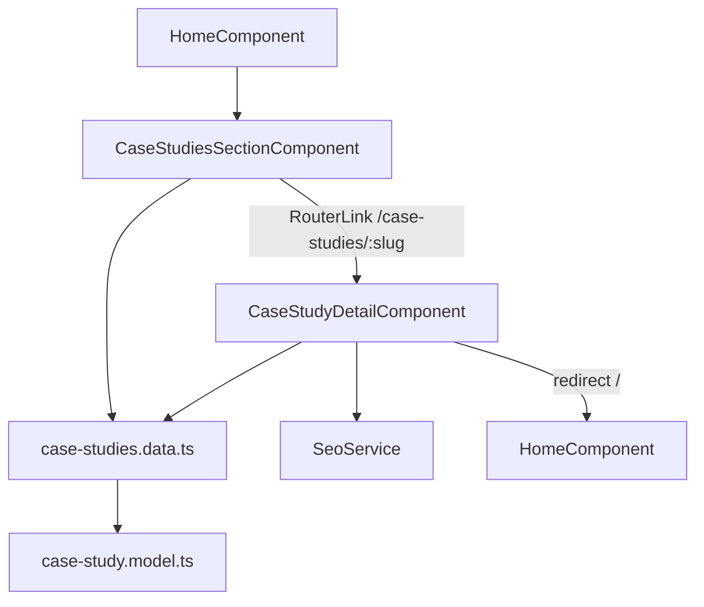

# Design Document: Client Case Studies

## Overview

The Client Case Studies feature adds a two-part experience to the Compufy Technology site:

1. A `CaseStudiesSectionComponent` embedded in the homepage between `HowWeWorkSection` and `CtaSection`, rendering a responsive card grid from static data.
2. A `CaseStudyDetailComponent` lazy-loaded at `/case-studies/:slug`, showing the full project narrative with SEO metadata and a live demo link.

All data is static TypeScript — no HTTP calls, no Firebase reads. The feature follows the existing project conventions: standalone OnPush components, Angular Signals for local state, Tailwind utility classes, and `RouterLink` for navigation.

---

## Architecture



Data flow is unidirectional: components read from the static data file; nothing writes back. The `SeoService` is called imperatively inside `ngOnInit`-equivalent logic (an `effect()` or direct call in the constructor) on the detail page.

---

## Components and Interfaces

### CaseStudiesSectionComponent

- **Selector**: `app-case-studies-section`
- **Path**: `src/app/features/case-studies/case-studies-section/case-studies-section.component.ts`
- **Inputs**: none — reads `CASE_STUDIES_DATA` directly
- **Template**: section wrapper → heading → `@if (caseStudies().length)` guard → responsive grid of cards
- Each card is an `<a [routerLink]>` wrapping the card content so right-click / open-in-new-tab works natively
- Tags rendered as pill badges using `brand-primary` accent
- Uses `@for` control flow with `track study.id`

### CaseStudyDetailComponent

- **Selector**: `app-case-study-detail`
- **Path**: `src/app/features/case-studies/case-study-detail/case-study-detail.component.ts`
- **Route**: `/case-studies/:slug` (lazy via `loadComponent`)
- **State**: `caseStudy = signal<CaseStudy | null>(null)` — populated from `CASE_STUDIES_BY_SLUG` using the `:slug` param
- **Navigation**: `inject(Router).navigate(['/'])` when slug not found
- **SEO**: calls `SeoService` methods directly after resolving the study
- **Live Demo Button**: conditional render using `ButtonComponent` with `variant="primary"`, wrapped in an `<a>` with `target="_blank" rel="noopener noreferrer"`

### SeoService (existing — extended usage)

The existing `SeoService` handles route-level SEO automatically via `NavigationEnd`. For the detail page, we call `title.setTitle()` and `meta.updateTag()` directly after slug resolution, overriding the automatic handler for that navigation. No changes to `SeoService` itself are needed — the detail component injects `Title` and `Meta` directly (same pattern the service uses internally), or we add a `setPage(config)` public method if one doesn't already exist.

Looking at the existing `SeoService`, it exposes a private `apply()` method. The detail component will inject `Title` and `Meta` directly from `@angular/platform-browser` to set the title and description, consistent with how `SeoService` works internally.

---

## Data Models

### CaseStudy interface (`src/app/data/models/case-study.model.ts`)

```typescript
export interface CaseStudy {
  id: string;
  slug: string;                // kebab-case, URL-safe
  clientName: string;
  projectTitle: string;
  shortDescription: string;   // used for card preview and SEO meta description
  tags: string[];
  problemStatement: string;
  solution: string;
  technicalDepth: string;
  liveDemoUrl: string;         // empty string when no live demo
}
```

### Static data file (`src/app/data/static/case-studies.data.ts`)

```typescript
export const CASE_STUDIES_DATA: CaseStudy[] = [ /* ≥2 entries */ ];

export const CASE_STUDIES_BY_SLUG: Map<string, CaseStudy> =
  new Map(CASE_STUDIES_DATA.map(cs => [cs.slug, cs]));
```

Slug uniqueness is enforced at runtime via a guard that throws during module initialisation if duplicates are detected:

```typescript
const slugs = CASE_STUDIES_DATA.map(cs => cs.slug);
const unique = new Set(slugs);
if (unique.size !== slugs.length) {
  throw new Error('CASE_STUDIES_DATA contains duplicate slugs');
}
```

This causes the app to fail fast during development and CI rather than silently serving wrong data.

---

## Correctness Properties

*A property is a characteristic or behavior that should hold true across all valid executions of a system — essentially, a formal statement about what the system should do. Properties serve as the bridge between human-readable specifications and machine-verifiable correctness guarantees.*

### Property 1: Slug map round-trip

*For any* array of `CaseStudy` objects with unique slugs, building a `Map` from that array and then looking up each entry by its `slug` must return the original object.

**Validates: Requirements 1.3, 4.2**

### Property 2: Slug uniqueness invariant

*For any* `CaseStudy` array, the number of distinct `slug` values must equal the total number of entries; if duplicates exist, the guard must throw an error.

**Validates: Requirements 1.4**

### Property 3: Section card count matches data length

*For any* array of `CaseStudy` objects (including the empty array), the `CaseStudiesSectionComponent` must render exactly as many cards as there are entries — zero entries produces no card elements.

**Validates: Requirements 2.2, 2.3**

### Property 4: Card renders required fields

*For any* `CaseStudy`, the rendered card HTML must contain the `projectTitle`, `clientName`, `shortDescription`, and one element per entry in `tags`.

**Validates: Requirements 2.4**

### Property 5: Card RouterLink points to correct slug path

*For any* `CaseStudy`, the card's anchor element must have an `href` (or `routerLink`) value equal to `/case-studies/{slug}`.

**Validates: Requirements 3.1**

### Property 6: Detail page renders required fields

*For any* resolved `CaseStudy`, the detail page HTML must contain the `projectTitle`, `clientName`, `problemStatement`, `solution`, `technicalDepth`, and all entries in `tags`.

**Validates: Requirements 4.3**

### Property 7: Live demo button conditionality and attributes

*For any* `CaseStudy`, if `liveDemoUrl` is non-empty the detail page must render an anchor with `target="_blank"` and `rel="noopener noreferrer"`; if `liveDemoUrl` is empty no such anchor must be present.

**Validates: Requirements 5.1, 5.2, 5.3**

### Property 8: Unknown slug triggers redirect with no partial render

*For any* string that does not match a slug in `CASE_STUDIES_BY_SLUG`, the detail component must call `router.navigate(['/'])` and the `caseStudy` signal must remain `null` (no content rendered).

**Validates: Requirements 6.1, 6.2**

### Property 9: SEO title format

*For any* resolved `CaseStudy`, the document title set by the detail page must equal `"{projectTitle} | Compufy Technology"`.

**Validates: Requirements 7.1**

### Property 10: SEO description matches shortDescription

*For any* resolved `CaseStudy`, the `description` meta tag content set by the detail page must equal the `shortDescription` field of that study.

**Validates: Requirements 7.2**

### Property 11: No SEO update on unknown slug redirect

*For any* string that does not match a slug in `CASE_STUDIES_BY_SLUG`, the detail component must not call `Title.setTitle()` or `Meta.updateTag()`.

**Validates: Requirements 7.3**

---

## Error Handling

| Scenario | Handling |
|---|---|
| Unknown slug in URL | Detail component reads `CASE_STUDIES_BY_SLUG`, gets `undefined`, calls `router.navigate(['/'])` immediately — no partial render |
| Empty `CASE_STUDIES_DATA` | `CaseStudiesSectionComponent` renders nothing (guarded by `@if (caseStudies().length)`) |
| Duplicate slugs in data | Runtime `throw` during module load — caught in dev/CI, never reaches production |
| Empty `liveDemoUrl` | `Live_Demo_Button` not rendered — guarded by `@if (study.liveDemoUrl)` |

---

## Testing Strategy

### Unit Tests (`.spec.ts`)

Unit tests cover specific examples, integration points, and edge cases. Avoid duplicating what property tests already cover broadly.

- **`case-studies.data.spec.ts`**: verify `CASE_STUDIES_DATA` has at least two entries (Req 1.2), verify `CASE_STUDIES_BY_SLUG` size equals data length, verify the duplicate-slug guard throws when given a duplicate.
- **`case-studies-section.component.spec.ts`**: verify the lazy route is registered at `case-studies/:slug` in `app.routes.ts` (Req 4.1), verify keyboard Enter on a card triggers navigation (Req 3.3).
- **`case-study-detail.component.spec.ts`**: verify `ButtonComponent` is used with `variant="primary"` for the live demo button (Req 5.4).

### Property-Based Tests (`.pbt.spec.ts`) — using fast-check

Each property test runs a minimum of 100 iterations. Each test is tagged with a comment referencing the design property.

**`case-studies.data.pbt.spec.ts`**

```
// Feature: client-case-studies, Property 1: Slug map round-trip
// Feature: client-case-studies, Property 2: Slug uniqueness invariant
```

- Property 1: Generate arbitrary arrays of `CaseStudy`-shaped objects with unique slugs → build a `Map` → assert every entry is retrievable by its slug.
- Property 2: Generate arrays with intentional duplicate slugs → assert the guard throws; generate arrays with all-unique slugs → assert the guard does not throw.

**`case-studies-section.component.pbt.spec.ts`**

```
// Feature: client-case-studies, Property 3: Section card count matches data length
// Feature: client-case-studies, Property 4: Card renders required fields
// Feature: client-case-studies, Property 5: Card RouterLink points to correct slug path
```

- Property 3: Generate arbitrary-length arrays of `CaseStudy` objects (including empty) → mount section → assert rendered card count equals array length.
- Property 4: Generate arbitrary `CaseStudy` objects → mount section → assert each card's DOM contains `projectTitle`, `clientName`, `shortDescription`, and all tags.
- Property 5: Generate arbitrary `CaseStudy` objects → mount section → assert each card anchor's `href` equals `/case-studies/{slug}`.

**`case-study-detail.component.pbt.spec.ts`**

```
// Feature: client-case-studies, Property 6: Detail page renders required fields
// Feature: client-case-studies, Property 7: Live demo button conditionality and attributes
// Feature: client-case-studies, Property 8: Unknown slug triggers redirect with no partial render
// Feature: client-case-studies, Property 9: SEO title format
// Feature: client-case-studies, Property 10: SEO description matches shortDescription
// Feature: client-case-studies, Property 11: No SEO update on unknown slug redirect
```

- Property 6: Generate arbitrary `CaseStudy` objects → mount detail with matching slug → assert DOM contains all six required fields.
- Property 7: Generate arbitrary `CaseStudy` objects with random `liveDemoUrl` (empty and non-empty) → assert anchor with `target="_blank"` and `rel="noopener noreferrer"` is present iff `liveDemoUrl` is non-empty.
- Property 8: Generate arbitrary strings not present in the slug map → mount detail → assert `router.navigate(['/'])` was called and `caseStudy` signal is `null`.
- Property 9: Generate arbitrary `CaseStudy` objects → mount detail → assert `Title.getTitle()` equals `"{projectTitle} | Compufy Technology"`.
- Property 10: Generate arbitrary `CaseStudy` objects → mount detail → assert `Meta` description tag content equals `shortDescription`.
- Property 11: Generate arbitrary unknown slug strings → mount detail → assert `Title.setTitle()` and `Meta.updateTag()` were not called.
