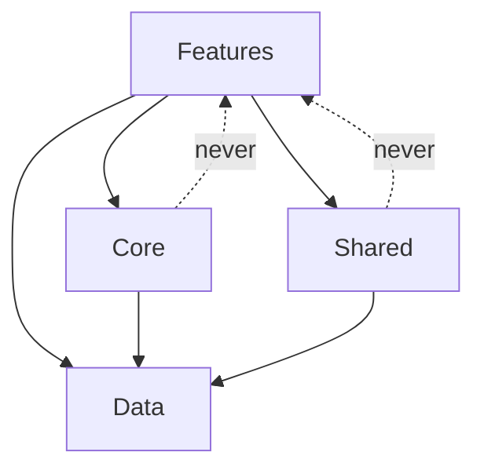
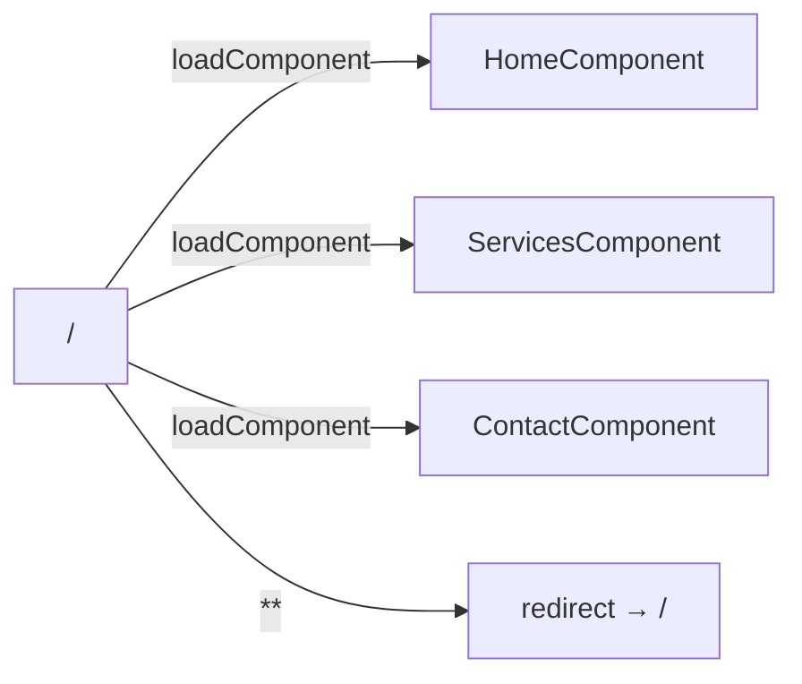

# Design Document

## Overview

Compufy Technology is a three-page Angular (v18+) corporate website built with Clean Architecture, standalone components, and a dark-mode-first glassmorphism aesthetic. The site presents the company brand, service offerings, and a contact form. It is structured for long-term maintainability using a strict folder hierarchy, Angular Signals for state, Tailwind CSS for styling, and lazy-loaded routes for performance.

The three public pages are:
- `/` — Home: hero section + "What We Do" overview
- `/services` — Services: categorized service cards with staggered animations
- `/contact` — Contact: typed reactive form with inline validation

Key technical decisions:
- Angular standalone components with `ChangeDetectionStrategy.OnPush` everywhere
- Angular Signals (`signal`, `computed`, `effect`, `toSignal`) replace RxJS for local/shared state
- Tailwind CSS with a custom `theme.extend` palette; no inline styles
- Lucide-Angular for individually-imported, tree-shakeable icons
- Angular Animations for scroll-reveal and staggered card entrances
- HTTP interceptor + global error handler in `core/`

---

## Architecture

The application follows Clean Architecture with a strict unidirectional dependency rule: Features depend on Core/Shared/Data; Core/Shared/Data never depend on Features.

```
src/
└── app/
    ├── core/           # Singleton services, interceptors, error handler
    ├── shared/         # Reusable dumb UI components (Button, Input, Card, Skeleton)
    ├── features/       # Lazy-loaded page components
    │   ├── home/
    │   ├── services/
    │   └── contact/
    ├── data/           # TypeScript interfaces, API constants, static data
    ├── theme/          # Tailwind config tokens (consumed by tailwind.config.ts)
    └── app.routes.ts   # Root route definitions with lazy loading
```

### Dependency Flow



### Routing Architecture



All routes use `loadComponent` with dynamic `import()`. `PathLocationStrategy` is the default (no hash URLs).

---

## Components and Interfaces

### Core Layer (`src/app/core/`)

| File | Responsibility |
|---|---|
| `http.service.ts` | Typed HTTP wrapper using `HttpClient`; returns `toSignal()` results |
| `error-handler.service.ts` | Implements `ErrorHandler`; exposes `errorSignal` |
| `http-error.interceptor.ts` | Catches HTTP errors, delegates to `ErrorHandlerService` |
| `error-notification/` | Standalone component rendered at app root; reads `errorSignal` |

### Shared Layer (`src/app/shared/`)

| Component | Inputs | Description |
|---|---|---|
| `ButtonComponent` | `variant`, `size`, `disabled`, `type` | Styled button with Tailwind variants |
| `InputComponent` | `label`, `control`, `type`, `placeholder` | Wraps a `FormControl`; shows validation errors |
| `CardComponent` | `title`, `description`, `icon` | Glassmorphism card shell |
| `SkeletonLoaderComponent` | `rows`, `height` | Animated placeholder shimmer |

All shared components are `standalone: true` with `ChangeDetectionStrategy.OnPush` and use typed `input()` signal functions.

### Feature Components

#### Home (`src/app/features/home/`)

| Component | Responsibility |
|---|---|
| `HomeComponent` | Page shell; orchestrates hero + what-we-do sections |
| `HeroSectionComponent` | Full-viewport hero with headline, subheadline, CTA button, CSS 3D tech element |
| `WhatWeDoSectionComponent` | Grid of 3+ service summary cards linking to `/services` |

#### Services (`src/app/features/services/`)

| Component | Responsibility |
|---|---|
| `ServicesComponent` | Page shell; reads service data from `ServicesDataService` |
| `ServiceCategoryComponent` | Renders a labeled category group |
| `ServiceCardComponent` | Individual glassmorphism card with Lucide icon, title, description |

#### Contact (`src/app/features/contact/`)

| Component | Responsibility |
|---|---|
| `ContactComponent` | Page shell; owns the `FormGroup`; handles submit logic |
| `ContactFormComponent` | Renders form fields using shared `InputComponent`; emits submit |
| `SuccessMessageComponent` | Animated confirmation shown after valid submission |

### Animation Strategy

Angular Animations are defined in a shared `animations.ts` file under `shared/animations/` and imported per-component. Key animations:

- `scrollReveal` — `trigger` that transitions `opacity: 0, translateY(30px)` → `opacity: 1, translateY(0)` on `:enter`
- `staggerCards` — parent trigger using `query(':enter', stagger(80ms, [animate(...)]))` for service cards
- `successFade` — fade + scale-up for the contact success message

---

## Data Models

All models live in `src/app/data/` as TypeScript interfaces. No classes with logic; pure data shapes.

```typescript
// data/models/service.model.ts
export interface ServiceCategory {
  id: string;
  label: string;           // e.g. "Web Development"
  services: Service[];
}

export interface Service {
  id: string;
  title: string;
  description: string;
  iconName: string;        // Lucide icon name, e.g. "code-2"
  category: 'web-development' | 'digital-solutions' | 'pitc';
}
```

```typescript
// data/models/contact.model.ts
export interface ContactFormValue {
  fullName: string;
  email: string;
  subject: string;
  message: string;
}
```

```typescript
// data/models/error.model.ts
export interface AppError {
  message: string;
  statusCode?: number;
  timestamp: Date;
}
```

```typescript
// data/constants/api.constants.ts
export const API_ENDPOINTS = {
  CONTACT_SUBMIT: '/api/contact',
} as const;
```

```typescript
// data/static/services.data.ts
// Static array of ServiceCategory objects — no API call needed for v1
export const SERVICES_DATA: ServiceCategory[] = [ ... ];
```

### Tailwind Theme Tokens (`tailwind.config.ts`)

```typescript
theme: {
  extend: {
    colors: {
      brand: {
        primary:   '#6366f1',  // indigo-500
        secondary: '#8b5cf6',  // violet-500
        accent:    '#06b6d4',  // cyan-500
      },
      surface: {
        DEFAULT: '#0f172a',    // slate-900
        card:    '#1e293b',    // slate-800
        glass:   'rgba(30,41,59,0.6)',
      },
    },
    backdropBlur: { glass: '12px' },
  }
}
```

---

## Correctness Properties

*A property is a characteristic or behavior that should hold true across all valid executions of a system — essentially, a formal statement about what the system should do. Properties serve as the bridge between human-readable specifications and machine-verifiable correctness guarantees.*


### Property 1: Feature routes use lazy loading

*For any* route defined in `app.routes.ts` that corresponds to a feature page (home, services, contact), the route configuration should use `loadComponent` with a dynamic `import()` expression rather than a direct component reference.

**Validates: Requirements 2.2, 2.3, 11.2**

---

### Property 2: What We Do section displays at least three categories

*For any* services data set containing N categories (N ≥ 3), the `WhatWeDoSectionComponent` should render at least three category summary items.

**Validates: Requirements 6.2**

---

### Property 3: Service cards are grouped by category

*For any* list of services, the `ServicesComponent` should render each service under its declared category group, and no service should appear under a category other than its own.

**Validates: Requirements 7.1**

---

### Property 4: Service card renders all required fields

*For any* `Service` object, the rendered `ServiceCardComponent` output should contain the service's title, description, and icon name.

**Validates: Requirements 7.2**

---

### Property 5: Full name validator rejects short inputs

*For any* string with fewer than 2 non-whitespace characters (including the empty string), the `fullName` `FormControl` validator should return an error; for any string with 2 or more characters, it should return null.

**Validates: Requirements 8.2**

---

### Property 6: Email validator accepts only valid email formats

*For any* string that does not match a valid email pattern (e.g., missing `@`, missing domain), the `email` `FormControl` validator should return an error; for any well-formed email address, it should return null.

**Validates: Requirements 8.3**

---

### Property 7: Subject validator rejects empty inputs

*For any* empty or whitespace-only string, the `subject` `FormControl` validator should return an error; for any non-empty string, it should return null.

**Validates: Requirements 8.4**

---

### Property 8: Message validator enforces minimum length

*For any* string with fewer than 10 characters, the `message` `FormControl` validator should return an error; for any string with 10 or more characters, it should return null.

**Validates: Requirements 8.5**

---

### Property 9: Touched invalid controls display error messages

*For any* `FormControl` that is both invalid and marked as touched, the `InputComponent` should render a non-empty error message element in the DOM.

**Validates: Requirements 8.6**

---

### Property 10: Invalid form submission marks all controls as touched

*For any* `ContactFormValue` where at least one field fails validation, calling the submit handler should result in every `FormControl` in the group having `touched === true`.

**Validates: Requirements 8.8**

---

### Property 11: Loading state shows skeleton loader

*For any* component that exposes a `loading` signal, when that signal is `true` the component's template should render the `SkeletonLoaderComponent` and not the content placeholder.

**Validates: Requirements 11.3**

---

### Property 12: HTTP errors propagate to error signal

*For any* HTTP response with a 4xx or 5xx status code, the `HttpErrorInterceptor` should catch the error and the `ErrorHandlerService.errorSignal` should become truthy with an `AppError` value containing the status code.

**Validates: Requirements 12.1, 12.2**

---

### Property 13: Truthy error signal renders notification

*For any* truthy value of `ErrorHandlerService.errorSignal`, the `ErrorNotificationComponent` should be present and visible in the DOM.

**Validates: Requirements 12.3**

---

## Error Handling

### HTTP Error Interceptor

`HttpErrorInterceptor` is registered as a functional interceptor via `provideHttpClient(withInterceptors([httpErrorInterceptor]))`. It intercepts all outgoing requests and catches errors in the response stream:

```typescript
export const httpErrorInterceptor: HttpInterceptorFn = (req, next) =>
  next(req).pipe(
    catchError((err: HttpErrorResponse) => {
      errorHandlerService.handleHttpError(err);
      return throwError(() => err);
    })
  );
```

### Global Error Handler

`AppErrorHandler` implements Angular's `ErrorHandler` interface and is provided at the root level. It catches unhandled JavaScript errors (including promise rejections via zone.js) and sets the error signal:

```typescript
@Injectable()
export class AppErrorHandler implements ErrorHandler {
  handleError(error: unknown): void {
    // log to console in dev, send to monitoring in prod
    this.errorHandlerService.setError({ message: String(error), timestamp: new Date() });
  }
}
```

### Error State Signal

`ErrorHandlerService` owns a `signal<AppError | null>(null)`. Components read this via `errorSignal = this.errorHandlerService.errorSignal` and the root `AppComponent` renders `<app-error-notification>` conditionally:

```html
@if (errorHandlerService.errorSignal()) {
  <app-error-notification [error]="errorHandlerService.errorSignal()!" />
}
```

### Form Validation Errors

Each `InputComponent` reads its bound `FormControl`'s `errors` and `touched` state. Error messages are mapped from Angular's built-in error keys (`required`, `minlength`, `email`) to user-friendly strings via a local `errorMessages` map inside the component.

---

## Testing Strategy

### Dual Testing Approach

Both unit tests and property-based tests are required. They are complementary:
- Unit tests cover specific examples, integration points, and edge cases
- Property tests verify universal correctness across randomized inputs

### Unit Tests (Jest or Jasmine/Karma)

Focus areas:
- Router configuration: verify `/`, `/services`, `/contact` routes exist and use `loadComponent`
- `HomeComponent`: renders hero section, CTA button present
- `ContactComponent`: form group has four controls; valid submission triggers success state; invalid submission marks all touched
- `ErrorHandlerService`: `handleHttpError` sets the signal; `clearError` resets it
- `HttpErrorInterceptor`: passes through 2xx; catches 4xx/5xx and delegates to service
- `AppErrorHandler`: calls `errorHandlerService.setError` on unhandled error
- `InputComponent`: renders error message when control is invalid and touched; hides it when untouched

### Property-Based Tests (fast-check)

Use [fast-check](https://github.com/dubzzz/fast-check) for TypeScript property-based testing. Configure each test suite with `{ numRuns: 100 }`.

Each property test must include a comment tag in the format:
`// Feature: compufy-technology-website, Property N: <property_text>`

| Property | Test Description | Arbitraries |
|---|---|---|
| P1: Lazy loading | All feature routes use `loadComponent` with dynamic import | N/A — structural check |
| P2: What We Do ≥ 3 | Given N≥3 categories, WhatWeDo renders N items | `fc.array(categoryArb, { minLength: 3 })` |
| P3: Cards grouped by category | All rendered cards match their declared category | `fc.array(serviceArb)` |
| P4: Card renders all fields | Rendered card contains title, description, icon | `fc.record({ title: fc.string(), description: fc.string(), iconName: fc.string() })` |
| P5: fullName validator | Strings < 2 chars → error; ≥ 2 chars → null | `fc.string()` |
| P6: Email validator | Invalid emails → error; valid emails → null | `fc.emailAddress()`, `fc.string()` |
| P7: Subject validator | Empty/whitespace → error; non-empty → null | `fc.string()` |
| P8: Message validator | < 10 chars → error; ≥ 10 chars → null | `fc.string()` |
| P9: Touched invalid shows error | Invalid+touched control → error element in DOM | `fc.record(...)` |
| P10: Invalid submit marks touched | Any invalid form → all controls touched after submit | `fc.record(...)` |
| P11: Loading shows skeleton | `loading = true` → skeleton rendered | `fc.boolean()` |
| P12: HTTP error → signal | 4xx/5xx response → `errorSignal` truthy with status | `fc.integer({ min: 400, max: 599 })` |
| P13: Error signal → notification | Truthy signal → notification in DOM | `fc.record({ message: fc.string(), ... })` |

### Test File Locations

```
src/
└── app/
    ├── core/
    │   ├── http-error.interceptor.spec.ts
    │   └── error-handler.service.spec.ts
    ├── shared/
    │   ├── button/button.component.spec.ts
    │   ├── input/input.component.spec.ts
    │   ├── card/card.component.spec.ts
    │   └── skeleton-loader/skeleton-loader.component.spec.ts
    ├── features/
    │   ├── home/home.component.spec.ts
    │   ├── services/services.component.spec.ts
    │   └── contact/contact.component.spec.ts
    └── app.routes.spec.ts
```
