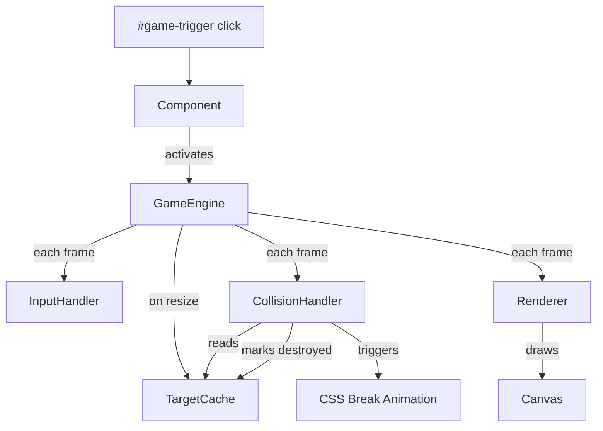

# Design Document: Rocket Game Overlay

## Overview

The Rocket Game Overlay is a browser-based mini 2D game rendered on an HTML5 Canvas that sits as a full-screen fixed overlay on top of the existing Compufy Technology website. The player pilots a rocket, fires bullets, and destroys DOM elements marked with the CSS class `target`. The feature is a single Angular 18 standalone component with co-located TypeScript modules, using Signals for reactive state and `requestAnimationFrame` for the game loop.

The overlay is SSR-safe: all browser-only APIs (`canvas`, `requestAnimationFrame`, `window`, `document`) are guarded with `isPlatformBrowser` from `@angular/common`.

---

## Architecture

The component lives at `src/app/features/rocket-game/` and is composed of:

- **`rocket-game-overlay.component.ts`** — Angular standalone component; owns the canvas element, game lifecycle signals, and wires all modules together.
- **`game-engine.ts`** — Orchestrates the game loop (delta-time, RAF scheduling, deactivation).
- **`input-handler.ts`** — Captures and normalises keyboard events; exposes a pure state object.
- **`entities.ts`** — TypeScript interfaces and plain-object factories for `Rocket`, `Bullet`, and `Particle`.
- **`collision-handler.ts`** — AABB intersection logic; pure functions, no DOM access.
- **`renderer.ts`** — All Canvas 2D draw calls; pure functions that accept context + state.
- **`target-cache.ts`** — Queries and caches `DOMRect` snapshots for `.target` elements.



---

## Components and Interfaces

### RocketGameOverlayComponent

```
selector: app-rocket-game-overlay
standalone: true
changeDetection: OnPush
```

Signals:
- `active = signal<boolean>(false)` — whether the game is running
- `canvasWidth = signal<number>(0)`
- `canvasHeight = signal<number>(0)`

Responsibilities:
- Renders the `<canvas>` element with fixed positioning and conditional `pointer-events`
- Listens for `#game-trigger` click to activate
- Listens for `Escape` keydown to deactivate
- Calls `isPlatformBrowser` before touching any DOM/canvas API
- Implements `OnDestroy` to cancel the loop, remove listeners, and restore target styles

### InputHandler

Tracks which keys are currently held. Exposes a readonly snapshot each frame.

```typescript
interface InputState {
  up: boolean;
  down: boolean;
  left: boolean;
  right: boolean;
  fire: boolean;
}
```

### Entities

```typescript
interface Rocket {
  x: number;
  y: number;
  vx: number;
  vy: number;
  angle: number; // radians, 0 = pointing up
}

interface Bullet {
  x: number;
  y: number;
  vx: number;
  vy: number;
}

interface Particle {
  x: number;
  y: number;
  vx: number;
  vy: number;
  born: number;   // timestamp ms
  lifespan: number; // ms (400)
}

interface TargetEntry {
  element: Element;
  rect: DOMRect;
  destroyed: boolean;
}
```

### GameEngine

```typescript
interface GameState {
  rocket: Rocket;
  bullets: Bullet[];
  particles: Particle[];
}
```

Runs the RAF loop, computes delta-time (capped at 0.05 s), applies velocity/friction, clamps rocket to bounds, manages bullet lifecycle, delegates collision and rendering.

### CollisionHandler

Pure functions:
- `testAABB(bullet: Bullet, target: TargetEntry): boolean`
- `runCollisions(state: GameState, cache: TargetEntry[], now: number): CollisionResult`

### Renderer

Pure functions:
- `renderFrame(ctx: CanvasRenderingContext2D, state: GameState, now: number): void`
- `drawRocket(ctx, rocket)`, `drawBullet(ctx, bullet)`, `drawParticle(ctx, particle, now)`

### TargetCache

- `buildCache(): TargetEntry[]` — queries `document.querySelectorAll('.target')`
- `refreshRects(cache: TargetEntry[]): void` — re-calls `getBoundingClientRect()` on live entries

---

## Data Models

### Rocket movement

Velocity is updated each frame from `InputState`. When no key is held, friction `0.85` is applied per frame:

```
vx *= 0.85
vy *= 0.85
```

Position update (delta-time scaled):
```
x += vx * dt * pixelsPerSecond
y += vy * dt * pixelsPerSecond
```

Rotation: `angle = atan2(vx, -vy)` when `sqrt(vx²+vy²) > 0.5`.

Boundary clamping uses rocket half-size so the sprite stays fully visible.

### Bullet lifecycle

- Created at rocket tip, velocity = `(sin(angle) * 600, -cos(angle) * 600)` px/s
- Removed when any edge of the bullet exits canvas bounds
- Max 20 simultaneous; new bullets are dropped if at capacity
- Fire-rate: one bullet per 200 ms; tracked via `lastFireTime` timestamp

### Particle lifecycle

- 8 particles per destruction event
- Each has random velocity in range `[-150, 150]` px/s per axis
- Lifespan: 400 ms; opacity = `remainingMs / 400`
- Removed when `now - born >= lifespan`

### Break animation CSS class

Applied to the target DOM element on destruction:

```css
.target-breaking {
  transition: transform 600ms ease-in, opacity 600ms ease-in;
  transform: translateY(200px) rotate(15deg);
  opacity: 0;
}
```

`transitionend` listener sets `visibility: hidden` and is then removed.

---

## Correctness Properties

*A property is a characteristic or behavior that should hold true across all valid executions of a system — essentially, a formal statement about what the system should do. Properties serve as the bridge between human-readable specifications and machine-verifiable correctness guarantees.*

### Property 1: Rocket stays within canvas bounds

*For any* canvas size and any sequence of velocity updates, the rocket's position after clamping shall satisfy `halfSize <= x <= width - halfSize` and `halfSize <= y <= height - halfSize`.

**Validates: Requirements 3.5**

### Property 2: Friction decelerates to near-zero

*For any* initial velocity vector, applying the friction coefficient `0.85` repeatedly shall produce a velocity magnitude that converges toward zero (never grows).

**Validates: Requirements 3.3**

### Property 3: Bullet count never exceeds maximum

*For any* sequence of fire events, the number of active bullets shall never exceed `20`.

**Validates: Requirements 4.2**

### Property 4: Out-of-bounds bullets are removed

*For any* canvas size and bullet position, if any edge of the bullet's bounding box lies outside `[0, width] × [0, height]`, the bullet shall not appear in the active bullet list after the next loop tick.

**Validates: Requirements 4.3**

### Property 5: AABB collision correctness

*For any* bullet rectangle and target rectangle, `testAABB` returns `true` if and only if the two rectangles overlap (standard AABB intersection).

**Validates: Requirements 6.2**

### Property 6: Destroyed targets are removed from cache

*For any* target cache, after a target is marked destroyed, it shall not be present in the set of non-destroyed entries returned for subsequent collision tests.

**Validates: Requirements 6.3**

### Property 7: Delta-time cap

*For any* pair of consecutive timestamps, the computed delta-time value passed to the game loop shall never exceed `0.05` seconds.

**Validates: Requirements 9.3**

### Property 8: Particle opacity is non-negative and bounded

*For any* particle and any timestamp within its lifespan, the computed opacity value shall be in the range `[0, 1]`.

**Validates: Requirements 8.2**

### Property 9: Fire-rate limit enforced

*For any* sequence of spacebar press events, no two bullets shall be created less than `200` milliseconds apart.

**Validates: Requirements 4.5**

---

## Error Handling

| Scenario | Handling |
|---|---|
| `#game-trigger` element not found at activation time | Guard with null check; log warning; do not activate |
| Canvas context unavailable (`getContext` returns null) | Guard with null check; deactivate immediately |
| `isPlatformBrowser` returns false (SSR) | All browser APIs skipped; component renders nothing |
| `getBoundingClientRect` returns zero-size rect | Target still cached; collision tests will simply never hit |
| `transitionend` never fires (e.g. element removed externally) | `visibility: hidden` is set defensively via a 700 ms fallback timeout |
| Component destroyed mid-loop | `ngOnDestroy` cancels RAF id and removes all listeners |

---

## Testing Strategy

### Unit Tests (`.spec.ts`) — Jasmine 5 + Karma 6

Focus on specific examples, edge cases, and integration points:

- `collision-handler`: specific overlapping and non-overlapping rectangle pairs
- `game-engine`: boundary clamping at exact edges, delta-time cap at exactly 0.05 s
- `target-cache`: cache build returns correct entry count, refresh updates rects
- `renderer`: `save()`/`restore()` call symmetry (spy on context)
- Component lifecycle: `ngOnDestroy` cancels RAF and removes listeners

### Property-Based Tests (`.pbt.spec.ts`) — fast-check 4

Each property test runs a minimum of **100 iterations**. Each test is tagged with a comment in the format:

`// Feature: rocket-game-overlay, Property N: <property text>`

| Property | Test description | fast-check arbitraries |
|---|---|---|
| P1: Rocket bounds | Arbitrary canvas size + velocity sequence → clamp → assert in bounds | `fc.integer`, `fc.array` |
| P2: Friction convergence | Arbitrary initial velocity → apply friction N times → magnitude ≤ initial | `fc.float`, `fc.integer` |
| P3: Bullet cap | Arbitrary fire event sequence → bullet count ≤ 20 | `fc.array(fc.boolean())` |
| P4: Bullet removal | Arbitrary canvas + bullet position outside bounds → removed after tick | `fc.record` |
| P5: AABB correctness | Arbitrary rect pairs → `testAABB` matches reference implementation | `fc.record` |
| P6: Cache cleanup | Arbitrary cache + destroy event → destroyed entry absent from live set | `fc.array` |
| P7: Delta-time cap | Arbitrary timestamp pairs → `min(raw_dt, 0.05)` | `fc.integer` |
| P8: Particle opacity | Arbitrary particle + timestamp in lifespan → opacity in [0,1] | `fc.record` |
| P9: Fire-rate | Arbitrary timestamp sequence → no two bullets < 200 ms apart | `fc.array(fc.integer())` |

Both unit and property tests are complementary: unit tests catch concrete bugs with known inputs; property tests verify general correctness across the full input space.
