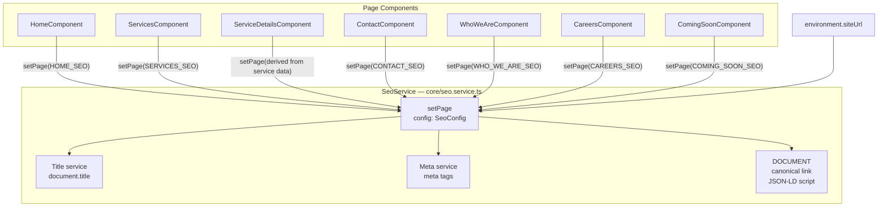

# Design Document: SEO Per Page

## Overview

This feature adds comprehensive, per-page SEO metadata to the Compufy Technology marketing website. A singleton `SeoService` centralises all tag management — document title, meta description, Open Graph, Twitter Card, canonical URL, and JSON-LD structured data — and is called from each page component's constructor. Because the app uses Angular SSR, all tags are injected during server-side rendering so crawlers and social scrapers receive fully-populated HTML without executing JavaScript.

The design is intentionally minimal: one new service, one new model, small additions to environment configs, and a one-liner `inject(SeoService).setPage(...)` call in each page component.

---

## Architecture



The service is `providedIn: 'root'` and injected directly in each page component via `inject()`. No router-level hooks or app-level lifecycle are needed — each component calls `setPage` synchronously in its constructor, which runs during SSR before the response is flushed.

---

## Components and Interfaces

### `SeoConfig` model — `src/app/data/models/seo.model.ts`

```typescript
export interface SeoConfig {
  title: string;           // Page-specific title (suffix added by service)
  description: string;     // Meta description
  canonicalPath: string;   // Path portion of canonical URL, e.g. "/services"
  ogImage?: string;        // Absolute URL to OG image; falls back to default
  ogType?: string;         // og:type value; defaults to "website"
  jsonLd?: Record<string, unknown>; // Schema.org JSON-LD payload
}
```

### `SeoService` — `src/app/core/seo.service.ts`

```typescript
@Injectable({ providedIn: 'root' })
export class SeoService {
  private readonly title   = inject(Title);
  private readonly meta    = inject(Meta);
  private readonly doc     = inject(DOCUMENT);
  private readonly siteUrl = environment.siteUrl ?? '';

  private static readonly SITE_NAME    = 'Compufy Technology';
  private static readonly DEFAULT_IMAGE = '/og-default.png';
  private static readonly JSON_LD_ID   = 'seo-json-ld';
  private static readonly CANONICAL_ID = 'seo-canonical';

  setPage(config: SeoConfig): void { ... }

  private upsertCanonical(href: string): void { ... }
  private upsertJsonLd(payload: Record<string, unknown>): void { ... }
  private removeJsonLd(): void { ... }
  private upsertRobotsNoIndex(): void { ... }
  private removeRobotsNoIndex(): void { ... }
}
```

Key implementation notes:
- `Meta.updateTag` is used for all meta tags (not `addTag`) to prevent duplicates on SSR hydration.
- The canonical `<link>` element is managed via `DOCUMENT` with a stable `id` attribute (`seo-canonical`) so it can be found and updated without querying all link elements.
- The JSON-LD `<script>` element is similarly identified by `id="seo-json-ld"`.
- `removeRobotsNoIndex` is called at the start of every `setPage` invocation so pages that follow a noindex page are always indexable unless they explicitly set noindex.

### Page components (modified)

Each page component gains a single line in its constructor:

```typescript
constructor() {
  inject(SeoService).setPage(PAGE_SEO_CONFIG);
}
```

`ServiceDetailsComponent` derives its config dynamically from the resolved service data:

```typescript
constructor() {
  const seo = inject(SeoService);
  const slug = inject(ActivatedRoute).snapshot.paramMap.get('id') ?? '';
  const service = SERVICES_BY_SLUG.get(slug) ?? null;
  if (service) {
    seo.setPage(buildServiceSeoConfig(service));
  } else {
    seo.setPageNotFound('Service Not Found');
  }
}
```

A small helper `setPageNotFound(label)` on `SeoService` sets the title and applies `noindex, nofollow`.

---

## Data Models

### Environment config additions

Both `environment.ts` and `environment.prod.ts` gain a `siteUrl` field:

```typescript
// environment.ts
siteUrl: 'http://localhost:4200',

// environment.prod.ts
siteUrl: 'https://compufy.tech',
```

### Static SEO configs — `src/app/data/static/seo.data.ts`

Static page configs are defined as constants (not computed at runtime) so they are tree-shakeable and easy to audit:

```typescript
export const HOME_SEO: SeoConfig = {
  title: 'Home',
  description: 'Compufy Technology delivers custom web applications, mobile apps, cloud infrastructure, and IT consulting — engineered for performance and built to scale.',
  canonicalPath: '/',
  ogType: 'website',
  jsonLd: { /* Organization schema */ },
};

export const SERVICES_SEO: SeoConfig = { ... };
export const CONTACT_SEO: SeoConfig  = { ... };
export const WHO_WE_ARE_SEO: SeoConfig = { ... };
export const CAREERS_SEO: SeoConfig  = { ... };
export const COMING_SOON_SEO: SeoConfig = { ... }; // no jsonLd; triggers noindex
```

`ComingSoonComponent` uses a dedicated `setComingSoon()` method (or a flag on `SeoConfig`) that additionally sets `robots: noindex, nofollow`.

### JSON-LD payloads

| Page | Schema type | Key fields |
|---|---|---|
| Home | `Organization` | name, url, logo |
| Services list | `ItemList` | itemListElement per category |
| Service detail | `Service` | name, description, provider |
| Contact | `ContactPage` | name, url |
| Who We Are | `AboutPage` | name, url |
| Careers | `WebPage` | name, url, description |

---

## Correctness Properties

*A property is a characteristic or behavior that should hold true across all valid executions of a system — essentially, a formal statement about what the system should do. Properties serve as the bridge between human-readable specifications and machine-verifiable correctness guarantees.*

### Property 1: Title suffix invariant

*For any* `SeoConfig` with any non-empty `title` string, after calling `setPage(config)` the document title must equal `config.title + " | Compufy Technology"`.

**Validates: Requirements 1.2**

---

### Property 2: All meta tags are set after setPage

*For any* `SeoConfig`, after calling `setPage(config)` the document head must contain all of the following tags with non-empty content values: `description`, `og:title`, `og:description`, `og:url`, `og:type`, `og:image`, `og:site_name`, `twitter:card`, `twitter:title`, `twitter:description`, `twitter:image`.

**Validates: Requirements 1.3, 1.4, 1.5**

---

### Property 3: Canonical URL is formed from siteUrl and canonicalPath

*For any* `SeoConfig` with any `canonicalPath`, after calling `setPage(config)` the `<link rel="canonical">` element's `href` must equal `siteUrl + config.canonicalPath`.

**Validates: Requirements 1.6, 10.2**

---

### Property 4: JSON-LD round-trip — inject then remove

*For any* `SeoConfig` with a `jsonLd` payload, after calling `setPage(config)` a `<script type="application/ld+json">` element must be present in the head. After subsequently calling `setPage` with a config that has no `jsonLd`, that script element must no longer be present.

**Validates: Requirements 1.7, 1.8**

---

### Property 5: Service detail SEO is derived from service data

*For any* valid service slug in `SERVICES_BY_SLUG`, after the `ServiceDetailsComponent` calls `setPage` the document title must contain the service's `title`, the meta description must contain the service's `overview` (truncated to 160 chars), and the canonical URL must end with `/services/` + the service's `slug`.

**Validates: Requirements 4.1, 4.2, 4.3**

---

### Property 6: noindex is set for excluded pages and removed for normal pages

*For any* call to `setPage` for the Coming Soon page or for an invalid service slug, the `robots` meta tag must be `"noindex, nofollow"`. *For any* subsequent call to `setPage` for a normal (indexable) page, the `robots` meta tag must not be present.

**Validates: Requirements 4.5, 4.6, 8.2, 8.3**

---

### Property 7: Repeated setPage calls do not produce duplicate meta tags

*For any* `SeoConfig`, calling `setPage(config)` twice in succession must result in exactly the same number of `<meta>` tags in the document head as calling it once — no duplicates are created.

**Validates: Requirements 9.3**

---

### Property 8: Default OG image is used when ogImage is absent

*For any* `SeoConfig` where `ogImage` is `undefined`, after calling `setPage(config)` the `og:image` and `twitter:image` meta tag content values must equal the service's default OG image path (`/og-default.png`).

**Validates: Requirements 11.2**

---

## Error Handling

| Scenario | Behaviour |
|---|---|
| `siteUrl` missing from environment | Service logs a `console.warn` and falls back to `''`; canonical URLs become relative paths |
| Invalid service slug | `setPageNotFound` sets title to `"Service Not Found \| Compufy Technology"` and applies `noindex, nofollow` |
| `jsonLd` serialisation throws | Caught in `upsertJsonLd`; error is logged, script tag is not injected |
| `DOCUMENT` unavailable (edge case) | Angular's DI provides a server-safe `DOCUMENT` token; no additional guard needed |

---

## Testing Strategy

### Unit tests (`.spec.ts`)

Unit tests use Jasmine + Karma with a `TestBed` that provides a real `DOCUMENT` (via `BrowserModule`) and spies on `Title` and `Meta` services.

Focus areas:
- `setPage` with a fully-populated config sets all expected tags (example)
- `setPage` with `ogImage` omitted uses the default image (example)
- `setPage` with `jsonLd` injects the script; second call without `jsonLd` removes it (example)
- `setPageNotFound` sets noindex; subsequent `setPage` removes it (example)
- Environment `siteUrl` fallback logs a warning (example / edge case)
- Each page component's constructor calls `setPage` with the correct config (example per page)

### Property-based tests (`.pbt.spec.ts`)

Property tests use **fast-check 4** with a minimum of **100 runs** per property. Each test is tagged with a comment referencing the design property.

```
// Feature: seo-per-page, Property 1: Title suffix invariant
// Feature: seo-per-page, Property 2: All meta tags are set after setPage
// Feature: seo-per-page, Property 3: Canonical URL formation
// Feature: seo-per-page, Property 4: JSON-LD round-trip
// Feature: seo-per-page, Property 5: Service detail SEO derived from data
// Feature: seo-per-page, Property 6: noindex set and removed correctly
// Feature: seo-per-page, Property 7: No duplicate meta tags
// Feature: seo-per-page, Property 8: Default OG image fallback
```

Generators needed:
- `fc.record({ title: fc.string({ minLength: 1 }), description: fc.string(), canonicalPath: fc.string(), ogType: fc.option(fc.string()), ogImage: fc.option(fc.webUrl()), jsonLd: fc.option(fc.object()) })` — arbitrary `SeoConfig`
- `fc.constantFrom(...SERVICES_BY_SLUG.keys())` — valid service slugs
- `fc.string()` filtered to not match any known slug — invalid slugs

Each property test creates a fresh `TestBed` (or resets the DOM) between runs to avoid state leakage.

### Test file locations

| File | Purpose |
|---|---|
| `src/app/core/seo.service.spec.ts` | Unit tests for `SeoService` |
| `src/app/core/seo.service.pbt.spec.ts` | Property-based tests for `SeoService` |
| `src/app/features/home/home.component.spec.ts` | Verifies `HomeComponent` calls `setPage` with correct config |
| `src/app/features/services/service-details/service-details.component.spec.ts` | Verifies dynamic config derivation and not-found handling |
