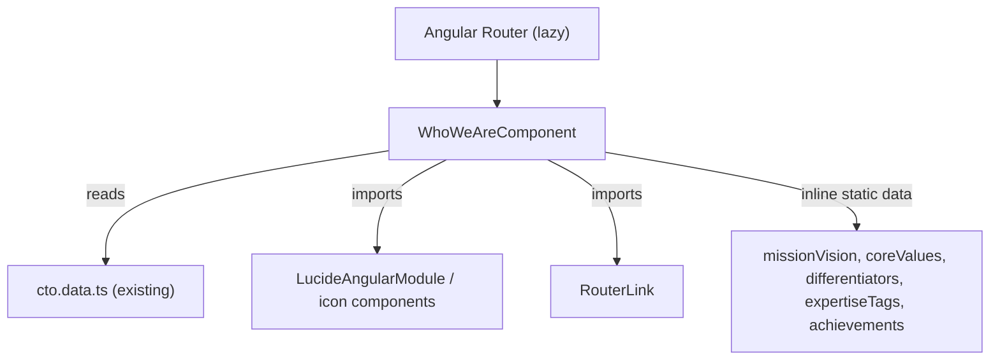

# Design Document: Who We Are Enhancement

## Overview

This feature enriches the existing `WhoWeAreComponent` at `src/app/features/who-we-are/who-we-are.component.ts` with eight new content sections and a polished team card layout update. All changes are confined to a single standalone Angular 18 component using inline Tailwind CSS, Lucide-Angular icons, and the existing brand/surface design tokens. No new routes, services, or data files are required — all new content is static and co-located in the component.

The page gains the following sections (in render order):

1. Page Hero (existing)
2. **Our Story** (new)
3. **Mission & Vision** (new)
4. **Core Values** (new)
5. **What Makes Us Different** (new)
6. **Our Expertise** (new)
7. Team Cards — Founder & CTO (updated layout)
8. **Team Philosophy** (new)
9. **Achievements / Milestones** (new)
10. **Call To Action** (updated content)

---

## Architecture

The enhancement is a pure template + class update to the single existing component. No new files are introduced beyond the component itself.



All section data (mission/vision text, core values, differentiators, expertise tags, achievements) is declared as `readonly` class properties directly on `WhoWeAreComponent`. No signals are needed since all data is static and the component uses `ChangeDetectionStrategy.OnPush`.

---

## Components and Interfaces

### WhoWeAreComponent (updated)

```
selector: app-who-we-are
standalone: true
changeDetection: OnPush
imports: [RouterLink, LucideAngularModule (or individual icon components)]
```

New readonly class properties:

```typescript
readonly missionVisionCards: MissionVisionCard[]
readonly coreValues: CoreValue[]
readonly differentiators: string[]
readonly expertiseTags: string[]
readonly achievements: AchievementStat[]
```

Existing properties retained:
```typescript
readonly founder: FounderProfile        // CTO data
readonly coFounderExpertise: string[]   // Founder badges
readonly teamValues: TeamValue[]        // "How We Work" grid (existing, kept)
```

### Lucide Icons

The following Lucide icons are used for Core Values. They are imported individually to keep the bundle tree-shakeable:

| Core Value | Icon |
|---|---|
| Innovation First | `Lightbulb` |
| Client-Centric Approach | `Users` |
| Performance & Quality | `Zap` |
| Transparency | `Eye` |
| Continuous Growth | `TrendingUp` |

Import pattern (Angular 18 standalone):
```typescript
import { LucideAngularModule, Lightbulb, Users, Zap, Eye, TrendingUp } from 'lucide-angular';
```

---

## Data Models

All models are local to the component file (no new `.model.ts` files needed — these are simple inline interfaces).

```typescript
interface MissionVisionCard {
  type: 'mission' | 'vision';
  heading: string;
  text: string;
  accentColor: 'brand-primary' | 'brand-accent';
}

interface CoreValue {
  label: string;
  icon: LucideIconData; // the imported Lucide icon reference
}

interface AchievementStat {
  value: string;   // e.g. "50+"
  label: string;   // e.g. "Projects Delivered"
}
```

### Static Data

```typescript
readonly missionVisionCards: MissionVisionCard[] = [
  {
    type: 'mission',
    heading: 'Our Mission',
    text: 'To build scalable, efficient, and future-ready technology solutions that empower businesses.',
    accentColor: 'brand-primary',
  },
  {
    type: 'vision',
    heading: 'Our Vision',
    text: 'To become a trusted technology partner for startups and enterprises globally.',
    accentColor: 'brand-accent',
  },
];

readonly coreValues: CoreValue[] = [
  { label: 'Innovation First',         icon: Lightbulb   },
  { label: 'Client-Centric Approach',  icon: Users       },
  { label: 'Performance & Quality',    icon: Zap         },
  { label: 'Transparency',             icon: Eye         },
  { label: 'Continuous Growth',        icon: TrendingUp  },
];

readonly differentiators: string[] = [
  'Focus on real-world scalable solutions',
  'Strong blend of business and technology thinking',
  'Fast execution with startup mindset',
  'Clean, maintainable, future-proof architecture',
];

readonly expertiseTags: string[] = [
  'Full Stack Development',
  'Cloud & DevOps',
  'AI & Automation',
  'System Design & Architecture',
  'Performance Optimization',
];

readonly achievements: AchievementStat[] = [
  { value: '50+',  label: 'Projects Delivered'   },
  { value: '30+',  label: 'Technologies Used'    },
  { value: '40+',  label: 'Happy Clients'        },
  { value: '5+',   label: 'Years of Experience'  },
];
```

### Team Card Layout Change

The existing CTO and Founder cards swap the heading/name order:

- **Before**: `<h2>` = title (e.g. "Chief Technology Officer"), `<p>` = name
- **After**: `<h2>` = designation (same title), `<p>` = name (subdued, smaller weight)

This is a template-only change; no data model changes are needed.

### Hover Effects

All hover effects are pure Tailwind CSS transitions applied inline:

```
transition-all duration-150 hover:border-brand-primary/40 hover:bg-surface-card/80
```

No JavaScript or Angular animations are required.

---

## Correctness Properties

*A property is a characteristic or behavior that should hold true across all valid executions of a system — essentially, a formal statement about what the system should do. Properties serve as the bridge between human-readable specifications and machine-verifiable correctness guarantees.*

### Property 1: Every core value has an associated icon

*For any* core value entry in the `coreValues` array, the rendered template shall contain a `lucide-icon` (or equivalent icon host element) within the same card element as the value's label.

**Validates: Requirements 3.3**

### Property 2: Every achievement stat card has both a numeric value and a label

*For any* entry in the `achievements` array, the rendered template shall contain both a non-empty numeric value string and a non-empty label string within the same stat card element.

**Validates: Requirements 8.3**

---

## Error Handling

| Scenario | Handling |
|---|---|
| `FOUNDER_DATA` is undefined or null | TypeScript strict mode + non-null `readonly` assignment prevents this at compile time |
| Lucide icon not found / not imported | TypeScript import error at compile time; tree-shaking removes unused icons |
| `routerLink="/contact"` route missing | Angular router navigates to wildcard redirect; no runtime error in component |
| Empty `coreValues` array | `@for` renders nothing; `@empty` block can show a fallback (optional) |
| Empty `achievements` array | `@for` renders nothing gracefully |

---

## Testing Strategy

### Unit Tests (`.spec.ts`) — Jasmine 5 + Karma 6

Focus on specific content and structural examples. Each test creates the component via `TestBed` with `NO_ERRORS_SCHEMA` or by providing stub icon components.

| Test | What it verifies |
|---|---|
| Our Story section renders | DOM contains the exact "Our Story" paragraph text (Req 1.2) |
| Mission card text | DOM contains mission text (Req 2.2) |
| Vision card text | DOM contains vision text (Req 2.3) |
| Exactly two mission/vision cards | Query selector count = 2 (Req 2.1) |
| Core Values section renders five items | `coreValues.length === 5` and five label elements in DOM (Req 3.2) |
| All five core value labels present | Each of the five label strings appears in the DOM (Req 3.2) |
| Exactly four differentiators | `differentiators.length === 4` and four items in DOM (Req 4.1) |
| All four differentiator texts present | Each string appears in the DOM (Req 4.2) |
| Expertise tags section renders five tags | Five chip elements in DOM (Req 5.2) |
| Team card designation is primary heading | `<h2>` contains "Chief Technology Officer" before the name (Req 6.1, 6.2) |
| Team card retains description and badges | Description paragraph and badge elements still present (Req 6.3) |
| Team Philosophy text present | DOM contains the philosophy paragraph text (Req 7.2) |
| Exactly four achievement stat cards | Four stat card elements in DOM (Req 8.1) |
| All four achievement labels present | Each label string appears in the DOM (Req 8.2) |
| CTA heading text | DOM contains "Have an idea? Let's build it together." (Req 9.2) |
| CTA link navigates to /contact | Anchor/routerLink has `href` or `routerLink="/contact"` (Req 9.3) |
| Background blobs preserved | Three blob `div` elements still present in DOM (Req 10.5) |

### Property-Based Tests (`.pbt.spec.ts`) — fast-check 4

Each property test runs a minimum of **100 iterations**. Each test is tagged with a comment in the format:

`// Feature: who-we-are-enhancement, Property N: <property text>`

| Property | Test description | fast-check arbitraries |
|---|---|---|
| P1: Icon per core value | Generate arbitrary arrays of `CoreValue`-shaped objects; for each, assert that the rendered card contains an icon host element | `fc.array(fc.record({ label: fc.string(), icon: fc.constant(Lightbulb) }))` |
| P2: Stat card completeness | Generate arbitrary arrays of `AchievementStat`-shaped objects; for each, assert both `value` and `label` are non-empty strings | `fc.array(fc.record({ value: fc.string({ minLength: 1 }), label: fc.string({ minLength: 1 }) }))` |

Both unit and property tests are complementary: unit tests verify the exact required content strings and structure; property tests verify general structural invariants across arbitrary data shapes.
