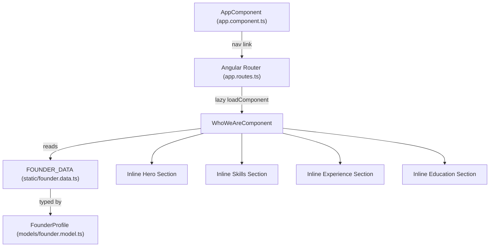

# Design Document: Who We Are Page

## Overview

The "Who We Are" page is a new lazy-loaded route (`/who-we-are`) on the Compufy Technology marketing website. It presents the founder's profile — name, title, location, professional summary, technical skills, work experience, and education — in a visually consistent dark-mode glassmorphism layout.

The page follows the same structural pattern as the existing Services and Home pages: a standalone Angular component with `ChangeDetectionStrategy.OnPush`, an inline template, Tailwind utility classes, and static data sourced from typed files under `src/app/data/`.

No backend calls are required. All content is static and bundled at build time.

---

## Architecture



The component is self-contained — all four sections (hero, skills, experience, education) are rendered inline within `WhoWeAreComponent`. No child sub-components are needed given the page's scope.

---

## Components and Interfaces

### WhoWeAreComponent

- Path: `src/app/features/who-we-are/who-we-are.component.ts`
- Selector: `app-who-we-are`
- `standalone: true`, `ChangeDetectionStrategy.OnPush`
- Inline template, Tailwind-only styling
- Reads `FOUNDER_DATA` directly (no service injection needed for static data)
- Imports: `LucideAngularModule` for icons

### Navigation Update

`src/app/app.component.ts` gains a nav bar with links to all pages including `/who-we-are`. Currently the app shell has no visible nav — a minimal top nav will be added consistent with the existing site aesthetic.

### Route Registration

`src/app/app.routes.ts` gains:
```typescript
{
  path: 'who-we-are',
  loadComponent: () =>
    import('./features/who-we-are/who-we-are.component').then(m => m.WhoWeAreComponent),
}
```

---

## Data Models

### FounderProfile (`src/app/data/models/founder.model.ts`)

```typescript
export interface SkillCategory {
  label: string;           // e.g. "Languages"
  skills: string[];        // e.g. ["C#", "JavaScript", "SQL"]
}

export interface ExperienceEntry {
  company: string;
  title: string;
  location: string;
  dateRange: string;       // e.g. "2022 – Present"
  highlights: string[];    // key projects / responsibilities
}

export interface EducationEntry {
  degree: string;          // e.g. "MCA"
  institution: string;
  yearRange: string;       // e.g. "2020 – 2022"
  score: string;           // e.g. "77.80%"
}

export interface FounderProfile {
  name: string;
  title: string;
  location: string;
  summary: string;
  role: string;            // e.g. "Founder, Compufy Technology"
  skillCategories: SkillCategory[];
  experience: ExperienceEntry[];   // reverse-chronological
  education: EducationEntry[];     // reverse-chronological
}
```

### FOUNDER_DATA (`src/app/data/static/founder.data.ts`)

A single exported constant of type `FounderProfile` populated with Avnish Yadav's details. Updating this file is the only change needed to update page content.

---

## Correctness Properties

*A property is a characteristic or behavior that should hold true across all valid executions of a system — essentially, a formal statement about what the system should do. Properties serve as the bridge between human-readable specifications and machine-verifiable correctness guarantees.*

### Property 1: All profile and section fields are rendered

*For any* `FounderProfile`, the rendered page should contain the founder's name, title, location, summary, and role, and for each experience entry it should contain the company, title, location, and date range, and for each education entry it should contain the degree, institution, year range, and score — no field should be silently dropped regardless of the data values.

**Validates: Requirements 2.1, 2.2, 2.3, 2.4, 2.5, 4.1, 4.2, 5.1**

### Property 2: All skills are rendered without omission

*For any* `FounderProfile` with any number of skill categories and any skills within them, every skill string present in the data should appear in the rendered DOM — none omitted or truncated.

**Validates: Requirements 3.1, 3.2, 3.3**

### Property 3: Section ordering matches data array order

*For any* `FounderProfile`, the order in which experience entries appear in the DOM should match the order of the `experience[]` array, and the order in which education entries appear in the DOM should match the order of the `education[]` array — preserving the reverse-chronological ordering defined in the data.

**Validates: Requirements 4.3, 5.2**

---

## Error Handling

This page has no async operations or user input, so error surface is minimal:

- **Missing static data**: TypeScript strict mode and the typed `FounderProfile` interface prevent accidental omission of required fields at compile time.
- **Empty arrays**: The template uses `@for` with `@empty` fallback blocks for skills, experience, and education to gracefully handle empty arrays without crashing.
- **Route not found**: The existing `**` wildcard redirect in `app.routes.ts` handles unknown paths; the new route is registered before it.

---

## Testing Strategy

### Unit Tests (`who-we-are.component.spec.ts`)

Focus on specific examples and integration points:

- Verify the component renders without errors using `FOUNDER_DATA`
- Verify the nav link to `/who-we-are` is present in `AppComponent`
- Verify the route `/who-we-are` resolves to `WhoWeAreComponent`
- Verify `@empty` fallback blocks render when arrays are empty

### Property-Based Tests (`who-we-are.component.pbt.spec.ts`)

Use **fast-check 4** (already in the project). Minimum **100 iterations** per property.

Each test is tagged with the format:
`// Feature: who-we-are-page, Property N: <property text>`

| Property | Test description |
|---|---|
| P1 | For any FounderProfile, all profile/experience/education fields appear in the DOM |
| P2 | For any FounderProfile, all skills in all categories appear in the DOM |
| P3 | For any FounderProfile, experience and education DOM order matches data array order |

**Arbitraries needed:**
- `skillCategoryArb`: `fc.record({ label: fc.string({minLength:1}), skills: fc.array(fc.string({minLength:1}), {minLength:1}) })`
- `experienceEntryArb`: `fc.record({ company, title, location, dateRange, highlights: fc.array(...) })`
- `educationEntryArb`: `fc.record({ degree, institution, yearRange, score })`
- `founderProfileArb`: composes the above with `fc.array` for collections

Run tests with: `ng test --watch=false`
